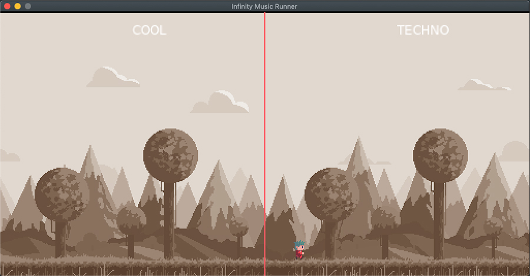
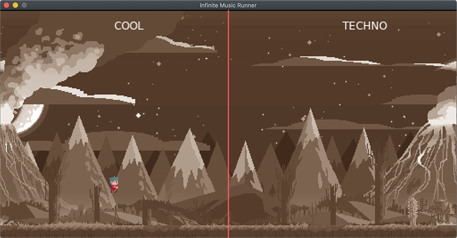

[Retourner au sommaire](../README.md)

InfiniteMusicRunner

#Lua #Löve2D

## Description :

Cette partie de la formation permet d'expérimenter l'intégration de bruitages (sons) dans un jeux vidéo. En développant
les bases d'un jeu de type "Infinite Runner" avec scrolling horizontale ainsi qu'un "music mixer" pour passer d'une
musique à une autre avec un effet de "fondu".

