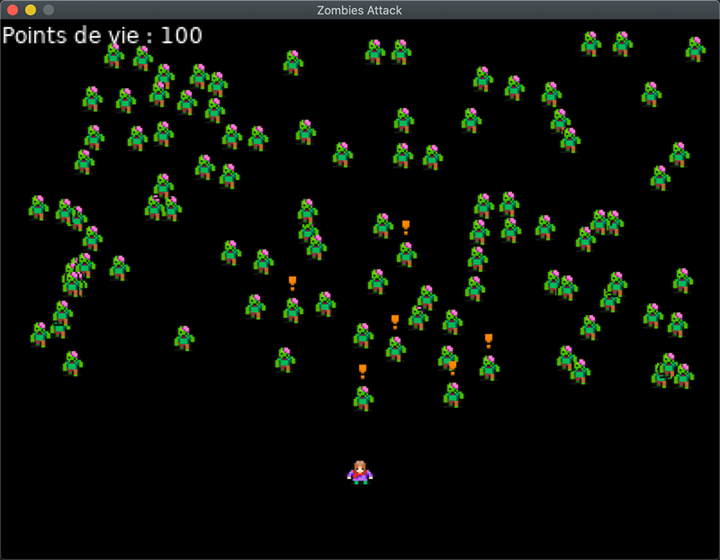

# 
ZombiesAttack

#Lua #Löve2D 

[Retourner au sommaire](../README.md)

## Description :

Cette partie de la formation permet d'expérimenter l'ajout de comportements à des zombies. En utilisant quelques
élements de base de l'Intelligence Artificielle (Agents, Machines à états, ... ) les zombies sont capables de traquer le
personnage lorsqu'il est proche d'eux et de transmettre l'information aux autres zombies proches. Si
le personnage ce déplace, les zombies le poursuivrons tant qu'il reste dans une certaine distance.

## Aperçu :

Détection des zombies proches

Déplacement du personnage

Alerte d'autres zombies plus éloigner

Mort du personnage

