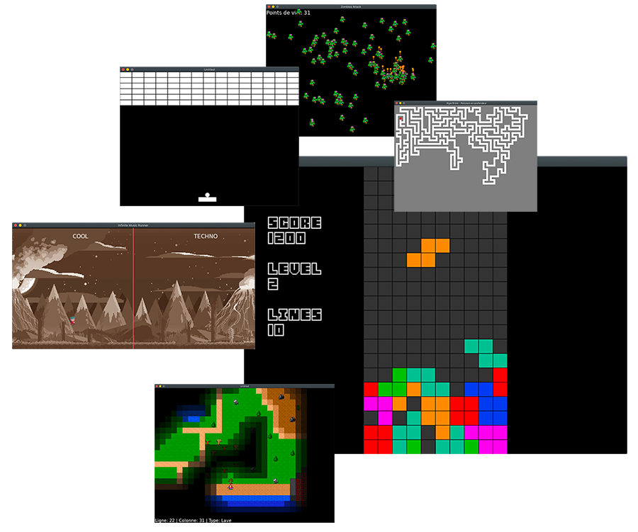

# Table des matières

1.  [Expérimentations](https://github.com/wmalbos/wmalbos#exp%C3%A9rimentations)  
1.  [Algorithmique](https://github.com/wmalbos/wmalbos#algorithmique)  
1.  [Jeux vidéos](https://github.com/wmalbos/wmalbos#jeux-vid%C3%A9os)  
1.  [Web](https://github.com/wmalbos/wmalbos#web)  
    1.  [Intégrations](https://github.com/wmalbos/wmalbos#int%C3%A9grations)
    1.  [Applications](https://github.com/wmalbos/wmalbos#applications)
    1.  [Portfolio](https://github.com/wmalbos/wmalbos#portfolio)
1.  [Autres Projets](https://github.com/wmalbos/wmalbos#autres-projets)  
1.  [Aides mémoires](https://github.com/wmalbos/wmalbos#aides-m%C3%A9moires)
    1.  [Programmation](https://github.com/wmalbos/wmalbos#aides-m%C3%A9moires)
    1.  [Languages](https://github.com/wmalbos/wmalbos#aides-m%C3%A9moires)
    1.  [Frameworks](https://github.com/wmalbos/wmalbos#aides-m%C3%A9moires)
    1.  [Outils de versionning](https://github.com/wmalbos/wmalbos#aides-m%C3%A9moires)
    1.  [Autres](https://github.com/wmalbos/wmalbos#aides-m%C3%A9moires)

 
 
 
 

## Expérimentations

#### C# et MonoGame
- [HorizontalScrollingParallax](./sources/CSHARP-MONOGAME-HorizontalScrollingParallax/) - Scrolling horizontal infinie des images de fond avec effets parallax
- [ImagesAndTests](./sources/CSHARP-MONOGAME-ImagesAndTests/)  - Insertion d'images et déformations

#### C# 
- [POO - Combats de terminal](./sources/CSHARP-TerminalFights/)  - Expérimentation de la POO en C#

#### LUA et Löve2D
- [InfiniteMusicRunner](./sources/LUA-LOVE2D-InfiniteMusicRunner/) -  Mixeur de sons et Gameplay de type "Infinite Runner" en scrolling horizontal 
- [ZombiesAttack](./sources/LUA-LOVE2D-ZombiesAttack/) - Détection et Tracking du personnage par les zombies
- [LunarLander](./sources/LUA-LOVE2D-LunarLander/) - Rotation, Gravité et Vélocité
- [TilesMoveAndCrash](./sources/LUA-LOVE2D-TilesMoveAndCrash/) - Déplacements et collisions d'un personnage sur une carte en brouillard de guerre
- [TileSheetMap](./sources/LUA-LOVE2D-TileSheetMap/) - Création de Tilemaps

#### JavaScript
- [JavaScript | Système solaire ](./sources/JS-SolarSystem/) - Animation du système solaire

## Algorithmique
- [Parcours en profondeur](sources/ALGO-DepthFirstSearch/) - Génération d'un labyrinthe avec le parcours en profondeur
- [Courbes de Béziers](https://github.com/wmalbos/Bezier-curves) - Génération de courbes de Béziers

## Jeux vidéos

#### C# et MonoGame
- [Dungeon Crawler](./sources/)  - Jeux vidéo en fausse 3D (bientôt)

#### LUA et Löve2D
- [Space shooter](./sources/LUA-LOVE2D-SpaceShooter/)  - Jeu vidéo de type Shoot'em up (bientôt)
- [Tetris](./sources/LUA-LOVE2D-Tetris/) - Jeu vidéo de puzzle sortie en 1984
- [Casse-briques](./sources/LUA-LOVE2D-CasseBrique/) - Jeu vidéo arcade sortie en 1975
- [Pong](./sources/LUA-LOVE2D-Pong/) - Jeu vidéo d'arcade sortie en 1972

#### JavaScript et Phaser.js
- [Plateforme2D ](./sources/JS-PHASER-Plateforme2D/) (bientôt)

#### JavaScript
- [Puissance 4  ](./sources/JS-Puissance4/) (bientôt)
- [Memory](https://github.com/wmalbos/GAME-Memory) - Jeu de société sortie en 1959

## Logiciels
- [Books scraping](https://github.com/wmalbos/Books-scraping) - Récupération de données depuis un site internet de test

## Web

#### Intégrations
- [Aria](./sources/WEB-Aria) - Intégration de la maquette (bientôt)
- [Justice](./sources/WEB-Justice) - Intégration de la maquette (bientôt)
- [Touché Restaurant](./sources/WEB-Touche-restaurant/) - Intégration de la maquette (bientôt)

#### Applications

#### Portfolio
- [Classique](./sources/PORTFOLIO-Classique) - Développé en 2018, utilisation de fichiers JSON pour simuler une base de donnée

## Autres Projets

- [Site vitrine]() - Site vitrine de démonstration - 100% du sur-mesure réalisé avec mon propre [CMS](). (bientôt)
- [eShop]() - Boutique de démonstration - 100% du sur-mesure réalisé avec mon propre [CMS](). (bientôt)
- [CMS]() - Simple d'utilisation, et complètement paramétrable, il est à la croisé de Wordpress et Prestashop pour le principe de gestion de contenu. Développé sous Symfony, il permet de développer toute nouvelle fonctionnalité rapidement tout en restant très abordable pour des clients n'apréciant pas l'informatique. (bientôt)
- [Ubuntu]() - Simulation d'un système d'exploitation au format web (bientôt)
- [InMoov]() - Ce projet me permet de réaliser un rêve, construire un robot grandeur nature, tout en apprenant la Robotique grâce à [InMoov](https://inmoov.fr/) (bientôt)

## Aides mémoires

#### Programmation
[Design Pattern](./aide_memoire/) - [Héritage](./aide_memoire/) - [Trait](./aide_memoire/)

#### Languages
[LUA](./aide_memoire/LANGUAGES-LUA/README.md) -  [C](./aide_memoire/) - [C++](./aide_memoire/) - [C#](./aide_memoire/) - [Java](./aide_memoire/) - [PHP](./aide_memoire/) - [Python](./aide_memoire/) - [Ruby](./aide_memoire/) - [JavaScript](./aide_memoire/) - [HTML](./aide_memoire/) - [CSS/SCSS](./aide_memoire/) 
  
#### Frameworks 
[Symfony](./aide_memoire/) - [Laravel](./aide_memoire/) - [Django](./aide_memoire/) - [RubyOnRails](./aide_memoire/)

#### Outils de versioning
[GIT](./aide_memoire/) - [SVN](./aide_memoire/)

#### Autres
 [Composer](./aide_memoire/) - [Docker](./aide_memoire/) - [Makefile](./aide_memoire/) - [JetBrains](./aide_memoire/)  
