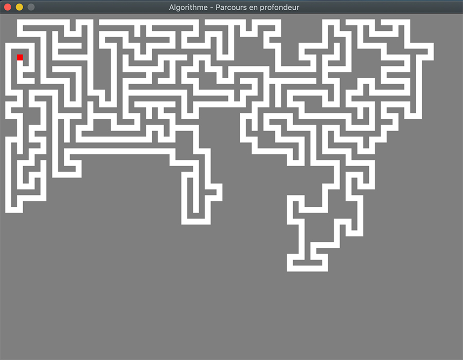
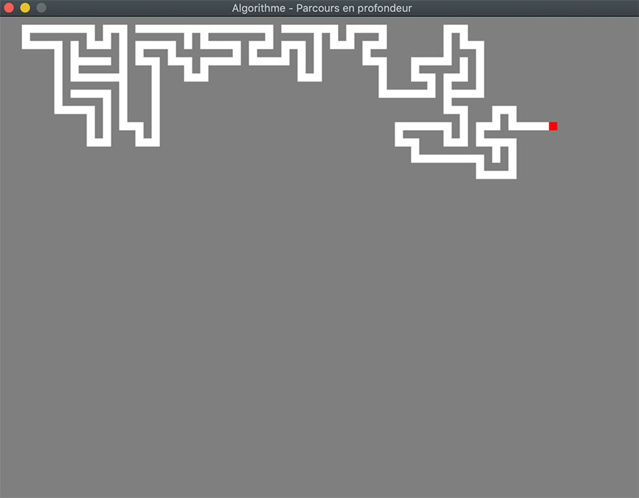
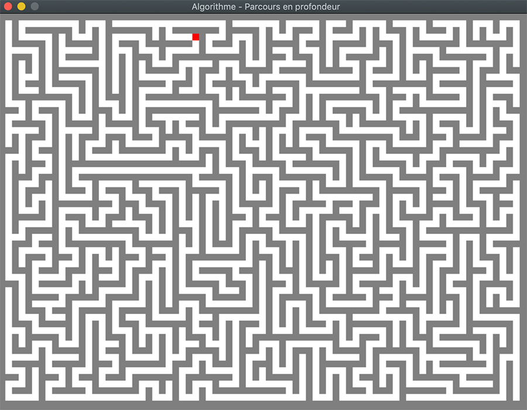

[Retourner au sommaire](../../README.md)

## Labyrinthe DepthFirstSearch

L'algorithme du parcours en profondeur est un algorithme de parcours d'arbre. 
Dans notre cas, il explore le graphe depuis un sommet initial jusqu'à avoir recouvers l'intégralité de l'arbre.

Il explore chaque sommet adjacent non visité jusqu'à atteindre un cul-de-sac ou un sommet déjà visité. Dans ce cas il revient au dernier sommet où l'on pouvais poursuivre un chemin, et recommence à visiter les sommets adjacents non marqué.  

[#Lua](https://github.com/lua/lua) [#Löve2D](https://github.com/love2d/love)

### Pseudo code

Initialement aucun sommet du Graphe n'est marqué

```
explorer(Graphe G, sommet s) :
    marquer le sommet s
    pour tout sommet t voisin du sommet s alors
        si t n'est pas marqué alors
            explorer(G, t)
```

```
parcoursProfondeur(Graphe G) :
    pour tout sommet s du graphe G :
        si s n'est pas marqué alors :
            explorer(G, s)
```

<p float="center">



</p>

