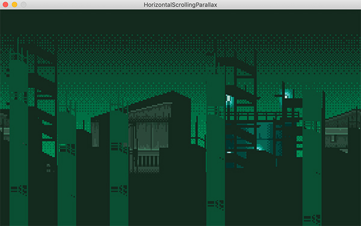
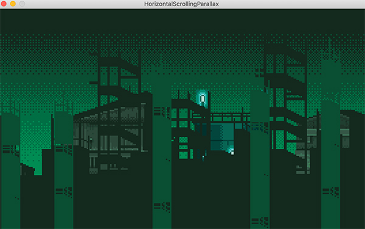
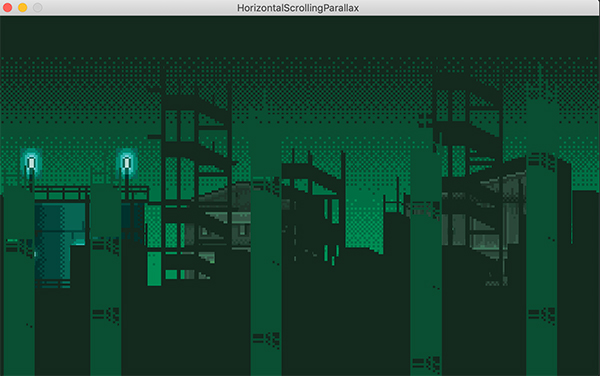

[Retourner au sommaire](../../README.md)

# HorizontalScrollingParallax

Cette partie de la formation permet d'expérimenter un scrolling horizontal infinie, et d'y rajouter un effet de parallax
en décalant les images de fond avec des vitesses différentes.

[#CSharp]() [#Monogame]()

