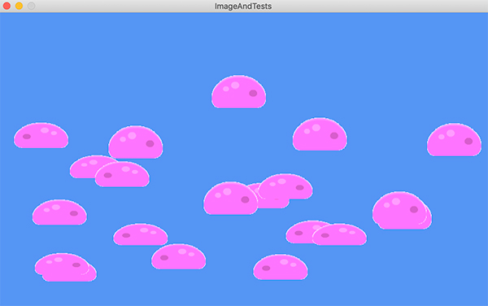
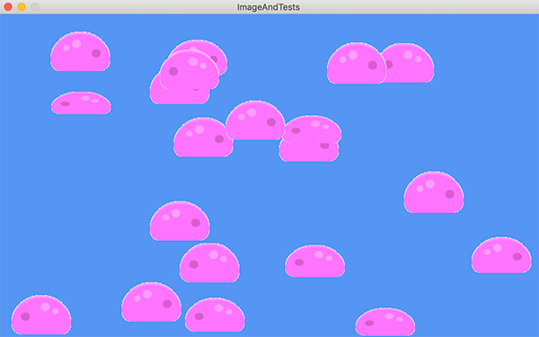

[Retourner au sommaire](../../README.md)

# ImagesAndTests

Cette partie de la formation permet d'expérimenter l'ajout d'images, leurs déplacements à l'écran ainsi que l'application de déformations à l'aide du language C# et du framework Monogame.

[#CSharp]() [#Monogame]()

