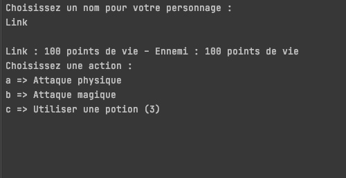

[Retourner au sommaire](../../README.md)

# Combats de terminal - POO 

Cette partie permet d'expérimenter l'utilisation de quelques notions de C# et de la programation orienté objets avec par exemple :
- L'encapsulation 
- L'abstraction
- L'héritage
- Le polymorphisme

[#CSharp]() 

