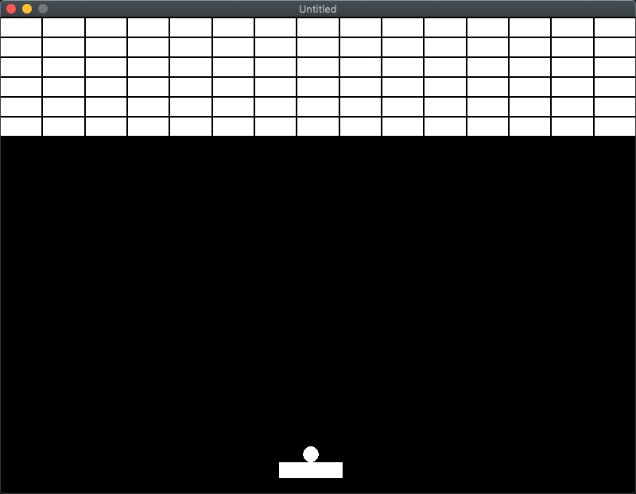
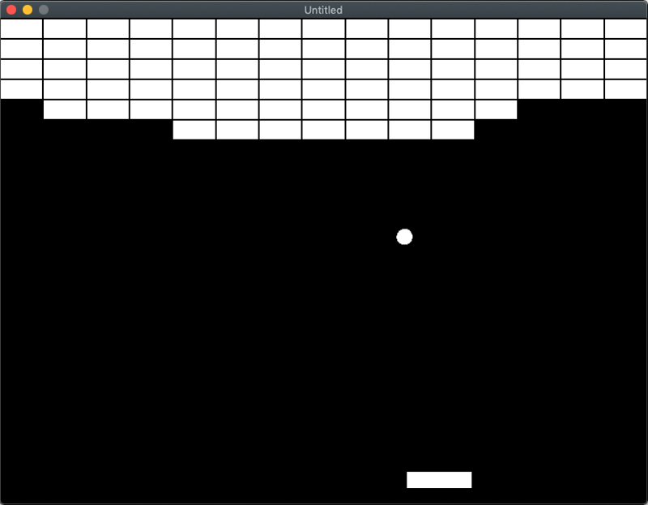

[Retourner au sommaire](../../README.md)

# Casse-briques

Le jeu **Casse-briques** (breakout) de la catégorie arcade, est sortie en 1975.

Inspiré du jeux [Pong](../LUA-LOVE2D-Pong), l'objectif est de détruire au moyen d'une balle et de ses effets, la totalité des briques du niveau pour accéder au niveau suivant.   
Le joueur contrôle une raquette pour faire rebondir la balle en direction des briques. 

[#Lua](https://github.com/lua/lua) [#Löve2D](https://github.com/love2d/love)

