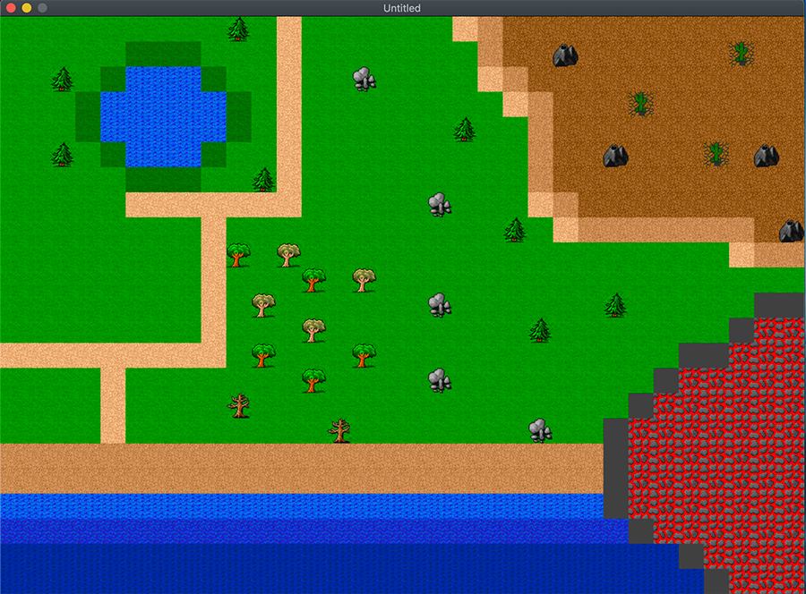

[Retourner au sommaire](../../README.md)

# TileSheetMap

Cette partie de la formation permet d'expérimenter la création de cartes en 2D avec des Tilesheet.

[#Lua](https://github.com/lua/lua) [#Löve2D](https://github.com/love2d/love)

