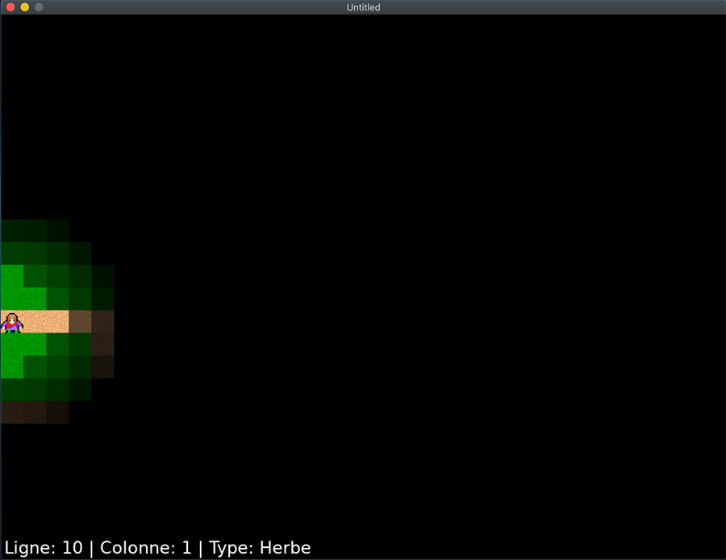
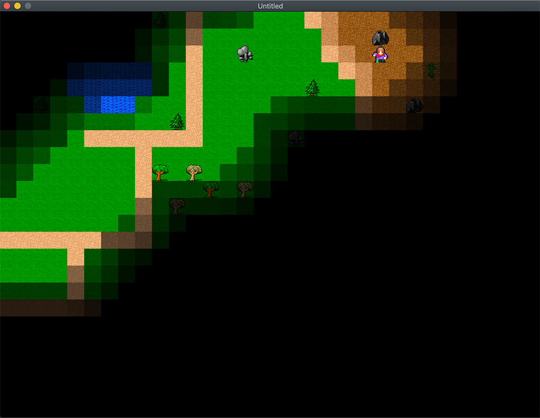
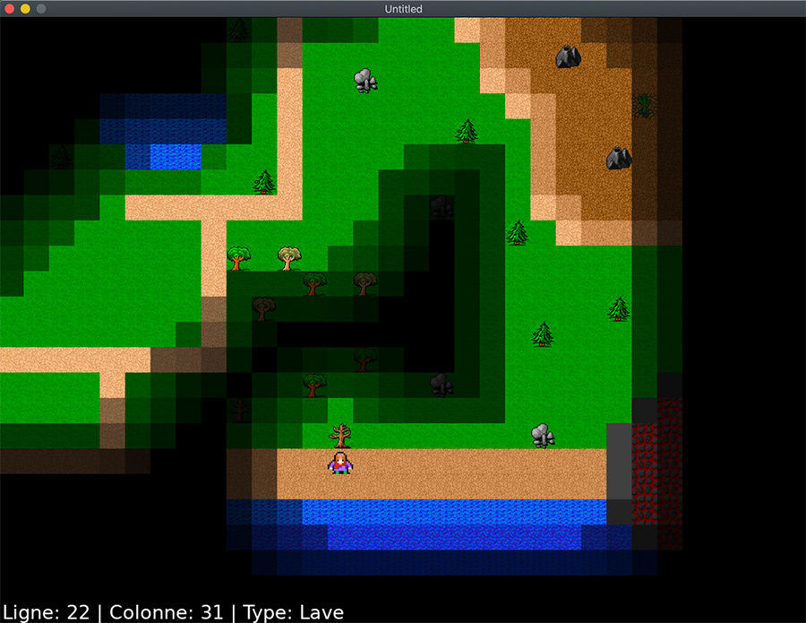

[Retourner au sommaire](../../README.md)

# TilesMoveAndCrash

Cette partie de la formation permet d'expérimenter le déplacements du personnage à l'aide du clavier, les collisions avec son environnement ( avec un son de crash ). Un brouillard de guerre se dévoile au fur et à mesure des déplacements du personnage.

[#Lua](https://github.com/lua/lua) [#Löve2D](https://github.com/love2d/love)

