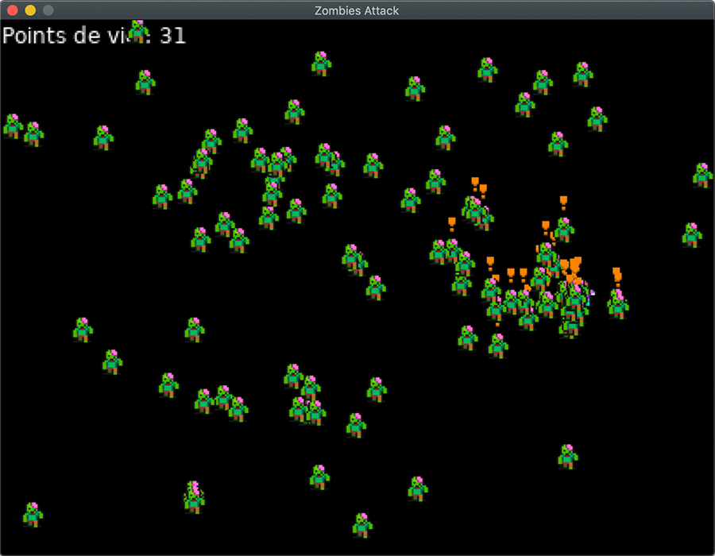
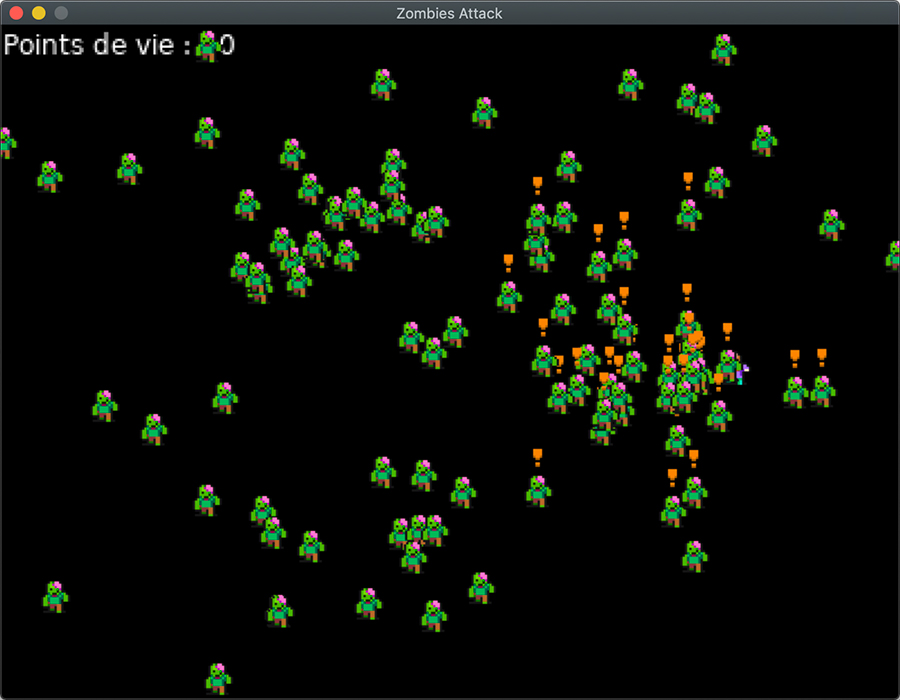
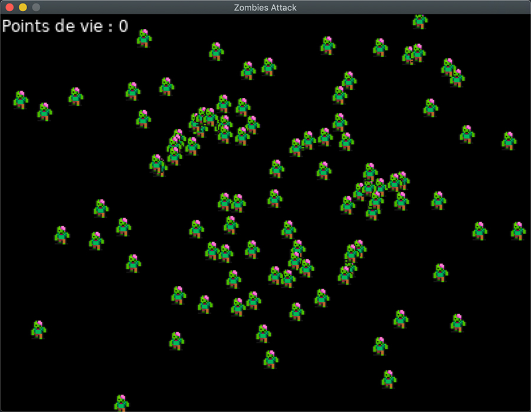

[Retourner au sommaire](https://github.com/wmalbos/wmalbos)

# ZombiesAttack 

Cette partie de la formation permet d'expérimenter l'ajout de comportements à des zombies. En utilisant quelques
élements de base de l'Intelligence Artificielle (Agents, Machines à états, ... ) les zombies sont capables de traquer le
personnage lorsqu'il est proche d'eux et de transmettre l'information aux autres zombies proches. Si
le personnage ce déplace, les zombies le poursuivrons tant qu'il reste dans une certaine distance.

[#Lua](https://github.com/lua/lua) [#Löve2D](https://github.com/love2d/love)

